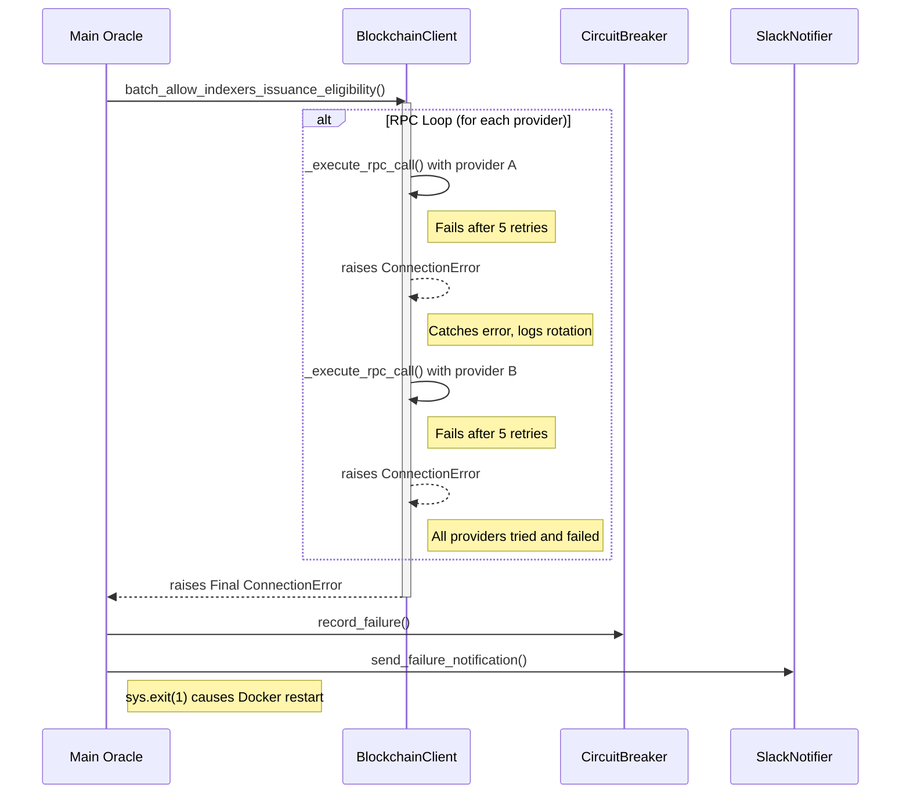

# Technical Design & Architecture

This document outlines key architectural decisions and data flows within the Service Quality Oracle.

## RPC Provider Failover and Circuit Breaker Logic

The application is designed to be resilient to transient network issues and RPC provider failures. It uses a multi-layered approach involving internal retries, provider rotation, and an application-level circuit breaker to prevent catastrophic failures and infinite restart loops.

The following diagram illustrates the sequence of events when all RPC providers fail, leading to a single recorded failure by the circuit breaker.

